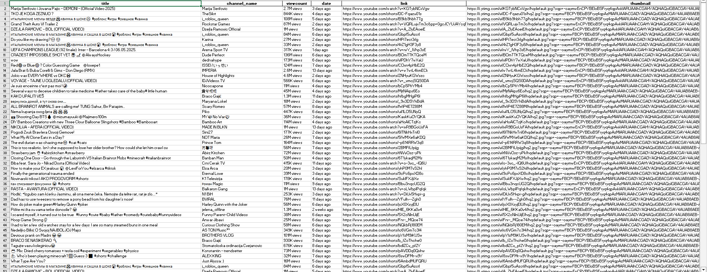

# YouTube Trending Scraper

This Python script uses Selenium and WebDriver to scrape trending YouTube videos. The program extracts video data such as title, channel name, view count, publication date, and video link, and saves the results in both Excel and JSON formats.

## Features

- **Scrapes YouTube Trending**: The script navigates to the YouTube trending page and extracts information on videos.
- **Extracts Data**: Includes video title, channel name, view count, publication date, video link, and thumbnail.
- **Scrolls to Load All Videos**: Automatically scrolls the page to load all trending videos.
- **Outputs to Excel and JSON**: Saves the scraped data to an Excel file (`.xlsx`) and a JSON file (`.json`).
- **Headless Browser Support**: Can run without a browser window using headless mode.

## Preview

Here’s a preview of the Excel output generated by the scraper:



## Requirements

- Python 3.x
- Selenium
- WebDriver Manager
- OpenPyXL
- Pandas

You can install the necessary libraries using `pip`:

```bash
pip install selenium webdriver-manager openpyxl pandas

Setup

    Install ChromeDriver: This script automatically installs the latest version of ChromeDriver using webdriver-manager.
    Headless Mode: By default, the script runs in headless mode (no browser window). You can change this by setting headless=False when setting up the driver.
    Running the Script: Once all dependencies are installed, you can run the script as follows: python youtubeTrending.py

Outputs

    Excel File: The data is saved in an Excel file named Youtube Trending.xlsx.
    JSON File: The data is also saved in a JSON file named Youtube Trending.json.

How It Works

    Setup WebDriver: Configures the Chrome WebDriver with options for headless browsing.
    Navigate to Trending Page: Visits YouTube's homepage and clicks on the "Trending" link.
    Scrolls to Load All Videos: Scrolls the page to ensure all trending videos are loaded.
    Extract Video Information: Extracts data like the video title, channel name, view count, and publication date.
    Save Data: Saves the extracted data into both Excel and JSON files.
    Print Data: Prints the extracted video details to the console.

Example Output in Json
Here's an example of the data printed for each video:

    Title: Example Video Title
    Channel: Example Channel Name
    View Count: 1,234,567 views
    Date: 1 day ago
    Link: https://www.youtube.com/watch?v=example
    Thumbnail: https://example.com/thumbnail.jpg
    ----------------------------------------------------------------------------------------------

```
